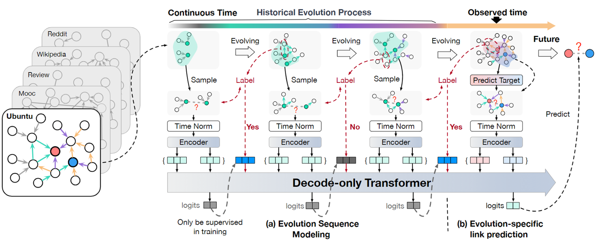

# CrossLink: Enhancing Cross-domain Link Prediction via Evolution Process Modeling

<div align="center">
<a href="https://arxiv.org/pdf/2402.02168.pdf"></a>
<a href="https://github.com/zjunet/CrossLink"></a>
<a href="https://weichow23.github.io/CrossLink/"></a>
<a href="https://huggingface.co/MeissonFlow/Meissonic">
    </a>
<a href="https://huggingface.co/datasets/WeiChow/DyGraphs">
    </a><br><br>
    <span style="color:red; font-size:27px;"><strong>WWW 2025</strong></span>
</div>


## 🚀 Introduction

CrossLink learns the evolution pattern of a specific downstream graph and subsequently makes pattern-specific link predictions. 
It employs a technique called *conditioned link generation*, which integrates both evolution and structure modeling to perform evolution-specific link prediction. This conditioned link generation is carried out by a transformer-decoder architecture, enabling efficient parallel training and inference. CrossLink is trained on extensive dynamic graphs across diverse domains, encompassing 6 million dynamic edges. Extensive experiments on eight untrained graphs demonstrate that CrossLink achieves state-of-the-art performance in cross-domain link prediction.  Compared to advanced baselines under the same settings, CrossLink shows an average improvement of **11.40%** in Average Precision across eight graphs. Impressively, it surpasses the fully supervised performance of 8 advanced baselines on 6 untrained graphs.



## 🛠️ Prerequisites

#### Environment

```shell
conda create -n your_env_name python=3.8
conda activate crosslink
pip install -r requirements.txt
```

#### Dataset

Please keep the dataset in the fellow format:

| Unnamed: 0 | u             | i             | ts                 | label        | idx                    |
| ---------- | ------------- | ------------- | ------------------ | ------------ | ---------------------- |
| `idx-1`    | `source node` | `target node` | `interaction time` | `defalut: 0` | `from 1 to the #edges` |

You can prepare those data by the code in `preprocess_data` folder

You can also use our processed data in [huggingface](https://huggingface.co/datasets/WeiChow/DyGraphs) 

## 💡 Usage

#### Training


#### Evaluation


## 📅 TODO

- [ ]  Release evaluation code and checkpoint
- [ ]  Release training code

## 💞 Acknowledgment

Our code is built refer to [DyGLib](https://github.com/yule-BUAA/DyGLib)

## 📚 Citation

If you find this work helpful, please consider citing:

```bibtex
@article{huang2024one,
  title={One Graph Model for Cross-domain Dynamic Link Prediction},
  author={Huang, Xuanwen and Chow, Wei and Wang, Yang and Chai, Ziwei and Wang, Chunping and Chen, Lei and Yang, Yang},
  journal={arXiv preprint arXiv:2402.02168},
  year={2024}
}
```
